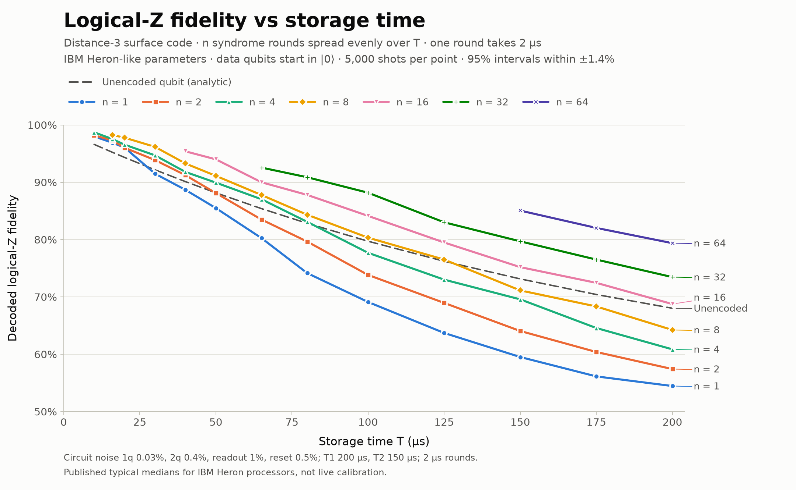
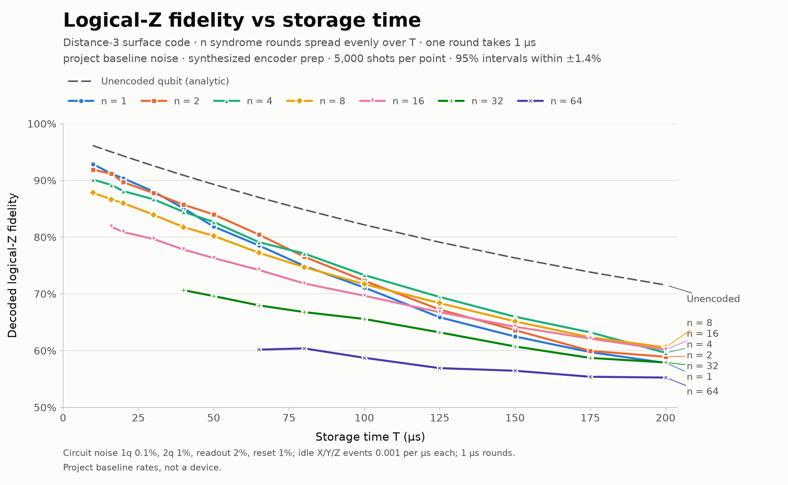

# Surface code

Distance-3 rotated planar code, written from scratch and designed independently
of any backend, with IBM Quantum as the first planned hardware target. The
package covers the [[9,1,3]] patch and its algebra, syndrome-extraction
circuits, a minimum-weight decoder and a syndrome-history decoder, a Qiskit Aer
simulation backend, and a fixed-duration logical-memory experiment with named
noise profiles.

## Repository layout

```text
src/surface_code/
    ├── core/         # Pauli and stabilizer-code algebra
    ├── patches/      # Geometry and the rotated distance-3 patch definition
    ├── circuits/     # Circuit operations and syndrome extraction
    ├── decoders/     # Minimum-weight lookup and syndrome-history decoders
    ├── simulation/   # Aer backend, memory experiments, noise profiles, CLI
    └── __init__.py   # Stable public API
docs/                 # Experiment write-ups (memory-cadence.md)
scripts/              # Reproducible figure generation
artifacts/            # Generated data and figures, one folder per profile
tests/
```

The concrete patch is defined once in `patches/rotated_d3.py`. Existing names
such as `Pauli`, `decode`, `STABILIZERS`, and `extract_syndrome` remain
available directly from `surface_code`.

## Run Aer

Install the simulator extra, then launch the interactive explorer:

```bash
python -m pip install -e '.[sim]'
surface-code
```

Edits build a persistent injected Pauli error; `measure` explicitly runs one ideal Aer
syndrome round. Try commands such as `x 4`, `y 2`, `xl`, `add X0 Z3`, `undo`,
`circuit`, and `info`. Run `help` inside the explorer for the complete menu.

The same tools work non-interactively:

```bash
# Run an injected error (the `run` word is optional).
surface-code X4 --shots 128 --seed 7
surface-code run 'X0 Z3' --counts
surface-code run XL --json

# Inspect the code without starting Aer.
surface-code syndrome 'X0 Z3'
surface-code decode '0000 1100'
surface-code info

# Explore generated circuits and decoder behavior.
surface-code circuit X4
surface-code sweep --axes XYZ --weight 1
surface-code sweep --weight 2 --failures-only
```

## Fixed-duration memory experiment

The `memory` command prepares logical zero, repeatedly measures and resets the
eight ancillas, retains a separate syndrome register for every round, and then
measures the data qubits in Z:

```bash
# Run the project's vendor-neutral baseline noise model.
surface-code memory --rounds 4 --shots 256

# Override circuit, readout, and reset error rates.
surface-code memory --rounds 8 --shots 1024 --seed 7 \
  --single-qubit-error 0.001 --two-qubit-error 0.01 \
  --readout-error 0.02 --reset-error 0.01

# Use the same experiment with no noise.
surface-code memory --rounds 4 --shots 256 --ideal

# Inspect the actual repeated circuit.
surface-code circuit --rounds 3
```

The `cadence` command runs the complete fixed-duration sweep. It includes a
no-check control, divides the same storage time among every requested number of
rounds, applies continuous-time idle noise, decodes the entire syndrome history
and final boundary with the syndrome-history decoder, and reports logical
failure with confidence intervals:

```bash
# Test bit and phase preservation for the same 10 us memory window.
surface-code cadence --time-us 10 --rounds 0 1 2 4 8 --shots 4096 --seed 7

# Isolate idle noise from circuit faults.
surface-code cadence --time-us 20 --rounds 0 1 2 4 8 \
  --ideal-circuit --idle-x-rate 0.002 --idle-y-rate 0 --idle-z-rate 0.003

# Emit the full result, including decoder weights, as JSON.
surface-code cadence --basis Z --json
```

### Noise profiles and state preparation

`--profile` selects a named parameter set from `surface_code.simulation.profiles`;
explicit `--*-error`, `--idle-*-rate`, and `--round-duration-us` options override
individual values on top of it.

| Profile | Two-qubit | Readout | Idle model | Round |
|---|---|---|---|---|
| `baseline` (default) | 1% | 2% | X/Y/Z events at 0.001 per µs each | 1 µs |
| `ibm-heron` | 0.4% | 1% | T1 200 µs, T2 150 µs | 2 µs |
| `google-willow` | 0.33% | 0.8% | T1 68 µs, T2 89 µs | 1 µs |

The baseline is a fixed reference for reproducible comparisons, not a device.
The device-like profiles convert published typical figures into the package's
parameters; they are not live calibration data and should be replaced with
measured backend properties before any claim about a specific machine.
`idle_noise_from_t1_t2` performs the T1/T2 conversion for any other device.

`--preparation` chooses how the logical state is prepared. `encoder` (default)
uses a synthesized Clifford, which is exact but adds 18 noisy two-qubit gates
before the first check. `product` starts every data qubit in |0⟩ (|+⟩ for an
X-basis test), as hardware experiments do; the checks of the measured type are
deterministic from the first round and the others only fix a reference frame.

```bash
surface-code cadence --profile ibm-heron --preparation product --time-us 100 \
  --rounds 0 1 4 16 32 --basis Z --shots 4096
```

The syndrome-history decoder exactly sums the 32 CSS syndrome/logical classes
of its independent-error model; its weights are an approximation to the richer
Aer circuit noise. The model omits a hardware topology, scheduled gate-level
T1/T2 decay during operations, leakage, and crosstalk. Within each check the
CNOTs are ordered so that a mid-round ancilla fault leaves its two-qubit hook
error across, not along, the logical operator of the same type. See
[`docs/memory-cadence.md`](docs/memory-cadence.md) for the mathematical model,
controls, interpretation, and limitations.

`--draw-error P [--draws N]` samples code-capacity Pauli errors on the data
qubits before the ideal circuit runs. The resulting Pauli is fixed across all
Aer shots: this is not per-shot channel sampling, gate noise, measurement
noise, or a repeated fault-tolerant syndrome experiment. Use `--seed` to
reproduce both the draw and Aer sampling.

Run `surface-code --help` for the commands and `surface-code COMMAND --help`
for command-specific options. `./sim` is a repository-local shortcut when a
`.venv` exists at the project root.

## Memory fidelity against storage time

`scripts/plot_memory_by_time.py` sweeps storage times from 10 to 200 µs for
n = 0, 1, 2, 4, 8, 16, 32, and 64 syndrome rounds spread evenly over each
window, then plots decoded logical-Z fidelity against an analytic unencoded
qubit under the same idle and readout noise. That dashed line is the
break-even bar: a curve above it means encoding helped.



With Heron-like parameters and product-state preparation the code beats the
bare qubit at every storage time, and every doubling of the round count keeps
helping. Under the project baseline the picture inverts: every encoded curve
sits below the bare qubit, because each 1 µs round adds more error than it
removes at those rates.



Each folder under `artifacts/` holds the full data (`data.json`, `data.csv`),
the figures, and the settings and library digest that produced them. To
regenerate or redraw:

```bash
python -m pip install -e '.[sim,plot]'
python scripts/plot_memory_by_time.py --profile ibm-heron --prep product
python scripts/plot_memory_by_time.py --plot-only          # redraw the baseline
```

Runs are resumable and extend an existing grid without repeating finished
points. Resuming normally requires the same source and settings. If you
deliberately use `--ignore-source-change`, each saved point retains its own
source digest; mixing versions is not a substitute for rerunning an experiment.

## Development checks

```bash
python -m pip install -e '.[dev]'
python -m pytest -q
ruff check src tests scripts
ruff format --check src tests scripts
```

CLI argument definitions live in `simulation/cli_arguments.py`; command execution
and interactive behavior live in `simulation/cli.py`. Simulator dependencies stay
lazy, so importing the algebra and decoders does not require Qiskit.
